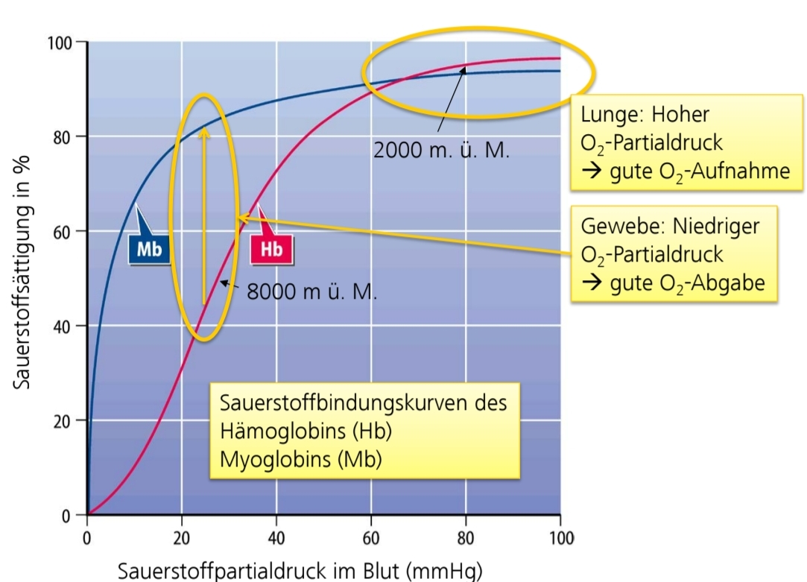

# Begriffe und Definitionen

## Organe (Wichtigste)

| Deutsch | Lateinisch | Griechisch |
| --------------- | --------------- | --------------- |
| Herz | Cor | Kardia |
| Gehirn | Cerebrum | Enkephalon |
| Lunge | Pulmo | Pneumon |
| Bauchspeicheldrüse | | Pankreas |
| Speiseröhre | Oesophagus | (Oisophagus) |
| Magen | (Ventriculus) | Gaster |

## Lagebezeichnungen

Um die Lage eines Objektes/ Organs im menschlichen Körper zu beschreiben, wird der Körper anhand von drei Ebenen unterteilt, die jeweils in der Mitte der jeweiligen Körperachse den Körper unterteilen.
Dazu zählen:

### Sagittalebene

Trennt rechte (**dexter**) von linker (**sinister**) Seite

### Frontalebene

Trennt vorne (**ventral**) von hinten (**dorsal**)

- venter: der Bauch
- dorsum: der Rücken

### Transversalebene

Trennt oben (**kranial**) von unten (**kaudal**)

- cranium: der Schädel
- cauda: der Schwanz

### Sonstiges

- proximal: zur Körpermitte hin
- distal: vom Körperzentrum entfernt

E.g. Die Schulter ist am Arm proximal, die Hand ist distal

- medial: annähernd in der Medianebene gelegen
- lateral: von der Medianebene weg, zur Seite hin

E.g Der Bauchnabel ist medial gelegen, der Ellbogen auf ähnlicher Höhe aber lateral

- superior: höher
- inferior: niedriger
- posterior: weiter hinten
- anterior: weiter vorne

## Vitalzeichen

## Diagnostisches Vorgehen

Um Krankheiten zu erkennen, schildert der Patient seine selbst wahrgenommenen **Symptome** in der **Anamnese**. Der Arzt untersucht den Patienten körperlich und notiert die festgestellten  Merkmale im **Befund** und kann aus diesem Befund eine (Verdachts-)**Diagnose** erstellen. 

Dieses Vorgehen ist nach dem Modell der Stufendiagnostik

Unterscheidung von sinvollen und nicht sinnvollen Maßnahmen für die Diagnostik:
- **Indizert**: sinvoll zu machen
- **Kontraindiziert**: nicht sinnvoll zu machen oder gar verboten, da belastend für Patienten etc.

### Anamnese

- **Eigenanamnese**: Patient wird über Symptome befragt
- **Fremdanamnese**: Angehörige, Freunde werden über Symptome des Patienten befragt
- **Vorbefunde**

### Körperliche Untersuchung

- **Inspektion**: Anschauen
- **Palpation**: Abtasten
- **Perkussion**: Abklopfen
- **Auskultation**: Horchen (mit Stethoskop)
- **Vitalzeichen** messen

### Vitalzeichen 

Können durch Kontrollmonitore überwacht und aufgezeichnet werden und bestehen aus:
- Artieller Blutdruck
- Pulsfrequenz
- Atemfrequenz
- Körpertemperatur
- Sauerstoffsättigung
- Bewusstsein

### Technische Untersuchungen

- Labordiagnostik: Blut, Urin, Stuhl etc.
- Funktionstest
- Bildgebende Verfahren: Echokardiographie, CT, MRT

### Befund
- **Physiologisch**: Normalbefund
- **Pathologisch**: Auffälliger Befund
- **Kursorisch unauffällig**: Auf den ersten Blick, oberflächlich unauffällig; wurde aber nicht näher untersucht

## Sonstiges 

- Klinik: Kurzform für "klinisches Bild"; Gesamtheit der Symptome, das Beschwerdebild eines Pat.
- Pathogenese: Entstehung einer Krankheit

# Herz

## Links und zusätzliche Quellen

- [kardiologie-gamm.de](https://kardiologie-gamm.de)

## Anatomie

- Lat. Name: **Cor**
- Lage: im Brustkorb (**Thorax**) überhalb des Zwerchfells (**Diaphragma**) und ist von der Lunge (**Pulmo**) umgeben
- Besteht aus rechter (**dexter**) und linker (**sinister**) Seite, jeweils mit Vorhof (**atrium**) und Herzkammer (**ventriculus**)
- Die linke Seite ist etwas kräftiger als die rechte Seite, da rechte Seite nur zur Lunge pumpen muss, die linke in den ganzen Körper
- Über die Vorhöfe kommt Blut in die Herzkammern rein, das über **Mitral** (li.) und **Trikuspidalklappe** (re.) in den Kammern gehalten wird
- Blut strömt aus Herz raus und wird von **Aorten-** (li.) und **Pulmonalklappe** (re.) in den Adern gehalten
- Herzkammern sind für den Druckaufbau da

### Herzklappen

- Stellen die Strömungsrichtung sicher

Zwischen den Kammern und abführenden Blutgefäßen:
- Aortenklappe (li.) und Pulmonalklappe (re.)
- Funktionsprinzip: **Taschenklappen**
- Sind kleiner als M. und T.

Zwischen den Vorhöfen und Kammern:
- Mitralklappe (li.) und Trikuspidalklappe (re.)
- Funktionsprinzip: **Segelklappe**
- Sind größer als A. und P.

Unterschied Taschen- und Segelklappen:
- Lediglich in der Art und Weise, wie sie sich öffnen und schließen. T. werden in eine Tasche eingezogen, während S. sich nach außen öffnen

## Weg des Blutes

- Sauerstoffarmes Blut gelangt in re. Herzkammer
- Blut wird von dort in die Lunge gepumpt und mit Sauerstoff angereichert
- Sauerstoffreiches Blut gelangt in li. Herzkammer und wird von dort in den Körper gepumpt

### Großer Kreislauf
- Körperkreislauf (Blut geht vom Herz in den Körper und wieder zum Herz)
- Hochdrucksystem (Blutdruck beträgt ca. 120/80 mmHg)
- Versorgung durch li. Herzkammer

### Kleiner Kreislauf
- Lungenkreislauf (Blut geht vom Herz zur Lunge und wieder zum Herz)
- Niederdrucksystem (Blutdruck beträgt ca. 20/8 mmHg)
- Versorgung durch re. Herzkammer

## Ablauf des Herzzyklus

### Systole

- Anspannung des Herzmuskels (1. Herzton)
- Öffnung der **Aorten-** und **Pulmonalklappe**
- Schließung der **Mitral-** und **Trikuspidalklappe**
- Blut wird in Arterien ausgetrieben

### Diastole

- Entspannung des Herzmuskels (2. Herzton)
- Schließung der **Aorten-** und **Pulmonalklappe**
- Öffnung der **Mitral-** und **Trikuspidalklappe**
- Passive Füllung der Herzkammern mit Blut aus den Venen

### Normale Erregungsausbreitung im Herzen

Dass das Herz sich zusammenziehen und entspannen kann, wird ein elektrischer Impuls am **Sinusknoten** gegeben. Diese elektrische Erregung breitet sich daraufhin im Herz aus, und die einzelnen "Unterimpulse" sind am EKG sichtbar:
- P: Ausbreitung der Erregung in den Vorhöfen => Vorhöfe ziehen sich zusammen und treiben Blut in die Herzkammern
- PQ-Strecke: Verzögerung am AV-Knoten (Atrioventrikularknoten; Nervenknoten zw. Vorhof und Kammer) für gezielte und verzögerte Weiterleitung => Zeit für Kammerfüllung 
- Q: Überleitung d. Erregung auf Kammern
- RS: Ausbreitung d. Erregung in den Kammern => Beginn Systole, da Kammerkontraktion
- T: Erregungsrückbildung der Kammern => Beginn Diastole

Nach einem EKG kann anhand der Kurve ausgewertet werden, ob die Impulse korrekt weitergeleitet werden und je nach Point of Failure ist zu erkennen, wann der Impuls nicht weiterkommt

## Diagnostik

### Auskultation

- Über "Kassendreieck" können mit Stethoskop das Herz auskultiert werden
- Bei normalem Befund (**physiologisch**) sind die beiden Herztöne wie gewohnt zu hören
- Bei auffälligem Befund (**pathologisch**) sind **Herzgeräusche** zu hören
- Je nachdem, ob die Geräusche während der Systole oder der Diastole auftreten, können Rückschlüsse auf die betroffene(n) Klappe(n) gezogen werden
- Zu beachten: Patient sollte ausatmen und die Luft anhalten, da sich Lunge mit Luft vors Herz schiebt
- Geräusche breiten sich außerdem in Blut aus, wodurch die betroffene Klappe lokalisiert werden kann

### Technische Diagnostik

- Belastungs-EKG: Riskant, da Patient bereits vulnerabel und das Herz in Ruhelage bereits belastet ist und nicht ausgereizt werden soll
- Röntgen: Erst im Spätstadium sichtbare Veränderung, da Herzmuskel nach innen wächst 

#### Elektrokardiographie (EKG)

Die Pumpfunktion des Herzen geht von einer elektrischen Erregung aus, die vom **Sinusknoten** initiiert wird und anschließend über das Herz ausgebreitet wird. Diese elektrischen **Potentialänderungen** kann man durch EKG-Elektroden an der Körperoberfläche abgreifen und relativ zur Zeitachse aufzeichnen.

Hierbei wird jedoch nur die Erregungsleitung im Herz aufgezeichnet und NICHT die tatsächliche Pumpleistung

Einsatzmöglichkeiten:
- Diagnostik von Herzrhytmusstörungen
- Diagnostik von Störungen der Erregungsausbreitung, z.B. bei:
  - Herzinfarkt (da Zellen absterben und Erregung nicht weiterleiten)
  - Elektrolytstörungen
- Diagnostik mancher Herzmuskelerkrankungen, insbesondere Hypertrophie
=> Zeichen der Linksherzhypertrophie (Herz kämpft gegen verklebte Aortenklappe an und wird somit kräftiger und wächst nach innen)
- Diagnostik der Lungenembolie (Warum? TODO)

#### Echokardiographie (Ultraschall)
- Aussendung von Ultraschallwellen:
  - niedrige Frequenz: Hohe Eindringtiefe, aber niedrige Auflösung
  - hohe Frequenz: Niedrige Eindringtiefe, aber hohe Auflösung
- Sobald USW auf Gewebe treffen, wird wird ein Teil reflektiert; aus diesem Echo kann ein Bild in Graustufen erstellt werden
- Gel wird auf Haut aufgetragen um ein Luftpolster zwischen Schallkopf und Haut zu vermeiden
- wird verwendet um zu untersuchen:
  - Wanddicke
  - Klappenfunktion
  - Blutfluss (Dopplereffekt)
  - Druckgradienten
- kann **transthorakal** (minimal invasiv) oder **transösophageal** (sehr invasiv -> zweite Wahl) angewandt werden

| Vorteile   | Nachteile    |
|--------------- | --------------- |
| Minimal invasiv   | Kompromiss zwischen Auflösung und Eindringtiefe   |
| Keine Strahlenbelastung   | Komplizierte Dokumentation (Mitschrift kann fehlerhaft sein, da Arzt etwas möglicherweise nicht erkennt; 20 min Video-Material sind langwierig zu durchsuchen)   |
| Preiswert, dadurch überall verfügbar   | Nachträgliche Behandlung (z.B. durch Erfahreneren) schwierig |
| Individuell duch Untersucher steuerbar   | Probleme bei adipösen Patienten |
| Livebild, Darstellung von Bewegungen (z.B. der Herzklappen) | Störung durch Luft/Kalk, daher schlecht geeignet für die Untersuchung von Gehirn, Knochen, Lunge |
| Kombination mit Doppleruntersuchung: Darstellung von Blutströmen | |
| Guter Weichteilkontrast, daher gut geeignet zur Untersuchung von: Bauchorganen, Schilddrüse, Gefäßen, Herz (jedoch Rippen und Lunge als Hindernis) | |

### Erkrankungen an den Klappen
- **Insuffizienz**: Klappe schließt nicht richtig und Blut läuft zurück; Undichtigkeit
- **Stenose**: Klappe ist verengt und geht nicht richtig auf, wodurch Blut schlechter durchkommt; Verengung

## Aortenstenose

Aortenklappe ist verklebt und geht nicht richtig auf
Aortenklappenfläche ist kleiner als typisch 

### Diagnostik

Auskultation: Herzgeräusche; erster Herzton ist kein Bumm, sondern eher langgezogenes Knirschen. Langgezogen deshalb, weil das Blut länger braucht um aus dem Herzen gedrückt zu werden
Echokardiographie mit Dopplereffekt: Blut wird langsamer als im Standardfall ausgetrieben
Linksherzkatheter: sehr invasiv und wird nur verwendet wenn Herzecho nicht möglich; teuer; Letalität 1:1000

### Therapie

Ersatz der Aortenklappe:
- Bei Patienten mit Beschwerden (ggf. unter Belastung) und schwerer Stenose
- auch in hohem Lebensalter

Aufdehnung der Aortenklappe nur in Ausnahmefällen:
- Junge Patienten (angeborene Herzfehler)
- Risiko der Klappeninsuffizienz

Medikamentiöse Behandlung kaum möglich, ggf. durch:
- Behandlung eines Bluthochdrucks
- Senkung der Blutfette

| Bioprothese   | Mechanische Prothese    |
|--------------- | --------------- |
| Vom Schwein oder Kalb   | Künstliches Material   |
| Leise   | Geräuschentwicklung   |
| Kürzere Haltbarkeit  | Lange Haltbarkeit   |
| Keine lebenslange Blutverdünnung   | Lebenslange Blutverdünnung erforderlich, damit Klappe nicht durch Blutgerinnsel verklebt => Risiko von Nebenwirkungen!  |
| Wird eher bei älteren Personen eingesetzt | Wird häufig bei jungen Personen eingesetzt |

### Operationstechnik

#### OP am offenen Herzen

- Einsatz der Herz-Lungen-Maschine
- OP-Sterblichkeit bei noch ausreichender Pumpfunktion 2-4%

#### Minimalinvasive OP (nur Bioprothese)

- Zugang über die Leiste (wie Herzkatheter) oder Herzspitze
- Alternative bei schwerkranken Patienten
- Sterblichkeitsrate nach 1 Jahr gleich niedrig wie konventionelle OP

### Prognose der Krankheit

- Gute Prognose bei Beschwerdefreiheit (plötzlicher Herztod < 1% pro Jahr)
- Durchschnittliche Lebenserwartung:
  - bei Atemnot/Brustschmerzen: 4-5 Jahre
  - bei Ohnmachtsanfällen: 2-3 Jahre
  - bei Zeichen der Pumpschwäche: 1-2 Jahre
- Überlebensrate liegt nach OP bei 80-90% über 5 Jahre

## Sonstiges Wissenswertes über das Herz 

- Zu viel Kalium im Blut kann zum Herzstillstand führen 

## AV-Block

[DocCheck Flexikon - AV-Block](https://flexikon.doccheck.com/de/AV-Block)

Herzrhytmusstörung, die durch Leitungsstörungen zwischen den Atrien und Ventrikeln entstehen

Diagnostik:
- Übelkeit, Schwindel, Dyspnoe
- Niedrigerer Puls
- mögliche Vorerkrankung des Herzen oder KHK

### Was ist das Problem?

Bei EKG-Befund zeigt die P-Welle an, dass die Vorhöfe erregt werden und sich optimalerweise zusammenziehen sollten. Nach kurzer Verzögerung sollte die Erregung am AV-Knoten an die Kammern gegeben werden, was aber nicht immer zuverlässig passiert

Je nach Ausprägung (Verzögerung oder komplette Blockierung des Erregers) kann dies zu einer **Reduktion der Herzfrequenz** führen, sodass die Pumpleistung des Herzen abfällt 

### Therapie

Bei "harmloseren" Ausprägungen meist keine Therapie nötig, ggf. Absetzen/Dosisreduktion der Medikamente

#### ... der Ursache

Therapie der zugrundeliegenden KHK 

Absetzen/Dosisreduktion von Medikamenten, da Arrhythmien auslösen können

#### ... der Symptome - Herzschrittmacher

Elektrische Aktivität in Vorhof und Kammer wird gemessen und ausbleibende Impulse werden erkannt (z.B. Fehlen d. QRS-Komplexes), woraufhin eine Impuls erzeugt wird

Muss nicht zwangsweise von Hezrchirurg eingesetzt werden; OP kann auch in Kardiologie erfolgen

Aggregat wird subkutan oder unterhalb der Brustmuskulatur eingesetzt. Sonden werden durch Vene vorgeschoben und im rechten Vorhof/Kammer verankert (Vene wird benutzt, da weniger Druck als in Arterie)

Letalitätsrisiko praktisch 0

# Arterielle Hypertonie

## Blutdruck

Abkürzung RR, nach Riva-Rocci

|  | Systolisch | Diastolisch |
| --------------- | --------------- | --------------- |
| Definition | RR, der während der Systole (Auswurfphase) im Gefäßsystem herrscht | RR, der während der Diastole (Entspannungsphase) im Gefäßsystem herrscht |
| Optimalwert | < 120 mmHg | < 80 mmHg |
| Normal - Hochnormal | 120-139 mmHg | 80-89 mmHg |
| Hypertonie | > 140 mmHg | > 90 mmHg |

Der Blutdruck ergibt sich aus dem **Herzzeitvolumen * Widerstand**, d.h. eine Änderung des Volumens des Blutes, des Widerstands, oder der Durchfußgeschwindigkeit wirkt sich direkt auf den Blutdruck aus

## Beschwerden

- Oft symptomlos
- ggf. Kopfschmerzen, v.a. morgens => Besserung bei Hochlagerung des Kopfes
- Schwindel, Ohrensausen
- Herzklopfen, Herzschmerzen
- Nasenbluten
- Belastungsdyspnoe

## Blutgefäße

 Bestehen im Wesentlichen aus drei Schichten, den **tunicae interna/media/externa**

### Arterien

#### Aufbau

Von innen nach außen:
Tunica interna
- Endothel
- Basalmembran
- Lamina elastica interna (Membran aus elastischen Fasern; ermöglicht Konstriktion und Dilatation)
Tunica media:
- glatter Muskel (dicker als in Vene, Durchflußbegrenzung nur hier nötig)
- Lamina elastica externa (ut supra)

#### Typen 

- Aorta und große Schlagadern
  - Elastischer Type
  - Windkesselfunktion (dehnt sich bei Systole langsam mit aus und zieht sich in der Diastole passiv wieder zusammen)
  - => Transport Blut in Organe
- Mittlere und kleine Schlagadern
  - Muskulärer Typ
  - => Steuerung des Widerstands
- Arteriolen
  - zunehmend dünnere Gefäße
- Kapillaren
  - nur noch Innenschicht
  - => Gas- und Stoffaustausch

### Venen

#### Aufbau

Ähnlich wie Arterie, jedoch ohne Laminae elasticae und der glatte Muskel ist viel dünner

Durchmesser wesentlich höher; außerdem Klappen als Rückschlagventile, sodass Blut nicht zurückfließt, wenn es ohne Druck gegen die Schwerkraft Richtung Herz fließt.

## Blutdruckkurven und Strömungsgeschwindigkeiten

Hier ist schematisch der Weg eines einzelnen Blutkörperchens auf dem Weg durch den Körper beginnend mit dem li. Vorhof und wann welche Messgrößen herrschen:

- Große Arterien:
  - geringer Durchschnitt
  - hoher Druck (Körperkreislauf)
  - schneller Fluß
  - Blut muss, no matter what, in die Organe!
- Kapillaren
  - hoher Durchschnitt
  - niedriger Druck
  - langsamer Fluß
  - Zeit für Stoffaustausch!
- Venen
  - hoher Durchschnitt
  - niedriger Druck (keine Pumpe!)
  - relativ langsamer Fluß

## Blutverteilung

Verschiedene Organe benötigen im Standardfall unterschiedlich viel Blut um zu funktionieren

Je nach Bedarf wird das Blut umverteilt und manche Organe werden stärker oder weniger stark durchblutet, z.B. durch:

| Aktivität | Organe mit stärkerer Durchblutung | Organe mit geringerer Durchblutung |
| --------------- | --------------- | --------------- |
| Arbeit, Sport | Muskeln, Herz | Ausscheidung, Verdauung |
| Entspannung, Schlaf | Verdauung, Ausscheidung | Muskeln |

Größte Variabilität: Skelettmuskel
Kaum Variabilität, zumindest nicht nach unten: Gehirn und Herz (kann nicht unter Standardaktiviät funktionieren)

Stärkere Durchblutung wird erreicht durch **Gefäßerweiterung** (Dilatation)

Geringere Durchblutung wird erreicht durch **Gefäßverengung** (Konstriktion)

## Vegetatives Nervensystem

Selbstregelndes Nervensystem, das die Selbsterhaltung des Körpers aufrechterhält und Funktion der Organe gewährleistet

Evolutionärer Hintergrund:
- Flucht-/Kampfreaktion => **Sympathikus**
- Nahrungsverwertung, Entspannung => **Parasympathikus**
- Beide existieren als Gegenspieler, haben meist gegenläufige Effekte am selben Organ
- Blut wird daraufhin umverteilt (ut supra)

### Sympathikus

- Ursprung größtenteils im Rückenmark der Brustwirbelsäule
- Signalübertragung durch **Adrenalin** (Stresshormon)
- wird aktiviert, wenn Körper in einer Hochbelastungssituation gelangt

### Parasympathikus

- Ursprung größtenteils im Hirnstamm
- Signalübertragung durch **Acetylcholin**

### α-Rezeptoren

- Stimulation glatter Muskelzellen
=> **Gefäßkonstriktion** (Verengung)
- Vorkommen v.a. Darm-, Hautgefäße

### β-Rezeptoren

- Entspannung glatter Muskelzellen
=> **Gefäßdilatation** (Erweiterung)
- Vorkommen v.a. Muskelgefäße, Herzkranzgefäße, kleine Bronchien
- Steigerung der Herzfrequenz, Schlagkraft, Atemleistung
- Steigerung des Abbaus von Energiespeichern (Leber, Muskel, Fettgewebe)

### Medikamentöse Nutzung der Adrenorezeptoren

- Nasenspray: α-Mimetika (Tut so, als wäre es Adrenalin, das an α-Rezeptoren andocken kann)
=> Verengung der Nasenchleimhautgefäße
- Asthmatherapie: β-Mimetika
=> Entspannung der Bronchiolen
- Bluthochdruck: β-Blocker
=> Senkung der Herzfrequenz und Schlagkraft
=> Nebenwirkungen: Asthmaanfälle, Erektionsstörungen
- Bluthochdruck: α-Blocker (v.a. in Blutdruckkrisen)

## Blutdruckmessung nach Riva-Rocci

Das Blut drückt mit einem gewissen Druck vom Herzen in die Arterien und Richtung da wo es gebraucht wird. Der RR wird gemessen, indem mit einem höheren Druck die Arterien "abgeschnürt" werden. Danach wird langsam der Druck abgelassen und der Druck, bei dem das Einstromgeräusch als erstes zu vernehmen ist, ist der systolische Blutdruckwert. Das Geräusch, bei dem das Einströmgeräusch verwindet, ist der diastolische Blutdruckwert

In Kurzform:
- Kompression der Arterien
- langsame Drucksenkung
- Erkennen des Einstromgeräusches:
  - Erstes Auftreten: Systolischer Blutdruckwert
  - Verschwinden/markant leiser und dumpfer: Diastolischer Blutdruckwert

Zu Beachten:
- Messpunkt auf Herzhöhe (üblich am Arm über Ellbogen)
- Messung in Ruhe, ggf. Liegen/Sitzen/Stehen 
- Mindestens einmal beidseitig messen 
- Nicht an einem Arm messen, an dem:
  - ein Gefäßzugang liegt
  - ein Dialyse-Shunt vorhanden ist
  - auf dessen Seite z.B. eine Brustkrebs-OP war
- Korrekte Manschettenbreite ca. 1/2 Armumfang
  - zu breit: falsch niedrige Werte
  - zu schmal: falsch hohe Werte 
- Ohne Stethoskop:
  - Palpatorische Messung, wann der Radialpuls wieder erfühlbar ist
  - Nur systolischer Druck messbar

## Kurz- mittelfristige Blutdruckregulation

Der Körper kann den globalen Blutdruck sehr schnell durch Ausschüttung einiger Substanzen steuern:

Vasokonstriktion:
- Vasopressin (ADH)
- Angiotensin II
- Sympathikus, Adrenalin (Haut, Darm, Niere)

Vasodilatation:
- Entzündungsmediatoren
- Sympathikus, Adrenalin (Gehirn, Herz, Muskeln)

### Kurzfristige Blutdruckregulation: Vegetatives Nervensystem

Sensoren messen an der Halsschlagader, ob ein Druckabfall oder Druckanstieg erfolgt und aktiviert somit je nachdem den Sympathikus oder Parasympathikus

- Bei Druckabfall: Aktivierung des Sympathikus und Hemmung des Parasympathikus => Steigerung der Herzfrequenz, Gefäßmuskulatur zieht sich zusammen
- Bei Druckanstieg: Aktivierung des Parasympathikus und Hemmung des Sympathikus => Senkung der Herzfrequenz, Gefäßmuskulatur dehnt sich aus

### Mittelfristige Blutdruckregulation: RAAS

Sensoren in der Niere messen, ob Druckanstieg oder Druckabfall erfolgt:

- Bei Druckanstieg: Natrium wird aus dem Blut ausgeschieden; Natrium zieht Wasser mit raus, wodurch das Plasmavolumen gesenkt wir und der Blutdruck sinkt 
- Bei Druckabfall: Natriumausscheidung aus dem Blut wird gehemmt; Plasmavolumen wird wieder größer, wodurch der Blutdruck wieder steigt 

## Folgen der Hypertonie

### Auf das Herz

#### Koronare Herzkrankheit

Gefäße werden enger und das Blut kommt nicht mehr an, wodurch der Herzmuskel nicht genügend mit Sauerstoff versorgt wird

#### Linksherzhypertrophie

Dauerbelastung des linken Herzen durch überhöhten Druck, wodurch das linke Herz **konzentrisch** (nach innen) wächst

Herzgröße bleibt an sich normal, aber Effizienz der Pumpe nimmt mit steigender Größe ab, wodurch sich Herz noch schneller verschlechtert

=> Herzinsuffizienz: Pumpversagen

### Auf das Gehirn

- Schädigung der hirnversorgenden Gefäße
- Minderdurchblutung, => Schwindel, Ohnmacht, Hirninfarkt
- Platzen eines Blutgefäßes

### Auf die Nieren

Bluthochdruck wirkt folgendermaßen auf die Nieren ein:

- Nierengefäße werden durch den Druck geschädigt
- Nieren werden schlechter durchblutet

Daraufhin ergeben sich zwei Teufelskreis, die beide zu einer Verchlimmerung der Hypertonie führen:

1. Niere misst "Druckabfall", der nur lokal existiert
  - Reninproduktion wird gesteigert
  - Angiotensin/Aldosteron wird aktiviert
2. Nierenfunktion verschlechtert sich
  - Urinausscheidung wird reduziert
  - Plasmavolumen steigert sich

## Maßnahmen zur Blutdrucksenkung

Ziel: Senkung des kardiovaskulären Risikos

### Nicht-Medikamentiös

- Gewichtsreduktion
- Nikotinabstinenz
- Alkoholabstinenz
- Salzarme Diät
- Ausdauersport
- Reduktion von Risikofaktoren (Blutzucker, Blutfette)

### Medikamentiös 

Senkung des Blutvolumens: Diuretika (Steigerung der Urinausscheidung)

Senkung der Herzfrequenz: Betablocker

Senkung des Gefäßwiderstands, Drosselung der Natriumresorption:
- Angiotensin-Convertin-Enzyme-Hemmer
- Angiotensin-II-Rezeptorblocker

=> Diese beiden blockieren Umwandlung von Angiotensin-I in AT-II

- Kalzium-Antagonisten

### Sekundäre Hypertonie

Therapie kommt auf Ursache der Hypertonie an:

| Ursache   | Therapie    |
|--------------- | --------------- |
| Nierenarterienstenose   | Arterie wird aufgedehnt   |
| Schwangerschaft   | im Extremfall verfrühte Entbindung   |
| Medikamentiös, Doping   | Absetzung der Substanzen   |

# pAVK / arterieller Gefäßverschluss

periphere arterielle Verschlusskrankheit

## Klinisches Bild 

### Symptome (6xp)

- **Pain**
- **Pulselessness**
- **Paralysis**
- **Pallor** (Blässe)
- **Paresthesia** (Missempfindung)
- **Prostration** (Schock)

- abgeschwächte Bein-/Fußpulse
- pathologischer Knöchel-Arm-Index
- ggf. Strömungsgeräusch über den Gefäßen, da enger (vgl. RR-Messung)
- blasse, dünne, kühle Haut durch schlechtere Durchblutung 
- reduzierte Behaarung

### Notfallversorgung

- Tieflagerung des Beins, sodass Blut durch Schwerkraft ins Bein gelangt
- Gabe von Blutgerinnungshemmer
- Gabe isotonischer Flüssigkeit i. v. zur Senkung der Blutviskosität

### Risikofaktoren

- Rauchen
- Medikamenttherapie nicht wahrgenommen 
- Bluthochdruck 

## Beschwerdebild

| Stadium   | Klinik    |
|--------------- | --------------- |
| I   | Geringe Engstellen, keine Beschwerden. Diagnose ggf. als Zufallsbefund   |
| IIa   | Schmerzen in Waden, Oberschenkeln u./o. Gesäß unter Belastung, max. schmerzfreie Gehstrecke > 200m   |
| IIb   | max. schmerzfreie Gehstrecke < 200m   |
| III   | Schmerzen in Ruhe, v.a. im Liegen (Schwerkraft drückt Blut nicht ins Bein)   |
| IV | Auftreten sichtbarer Gewebeschädigungn (Nekrosen), "Raucherbein" (*warum Bein und nicht Arm? RR ist am Bein höher -> Gefäße gehen dort schneller kaputt*) |

## Rolle des Cholesterins

- Lebenswichtiges Lipid, da Ausgangssubstanz für:
  - Zellmembranbestandteile
  - Hormone, z.B. Cortisol, Östrogen, Testo 
- Transport im Blut durch Lipoproteine:
  - LDL: transportiert Cholesterin ins Gewebe
  -> lass das lieber
  - HDL: holt Cholesterin aus Gewebe ab 
  -> hat dich lieb 
  - Ablagerung von Cholesterin bei LDL-Überproduktion

Xanthelasmen: Gelbliche Einlagerungen an den Augen 

## Ursache: Arteriosklerose

- "Verhärtung der Arterien": durch lokale Ablagerung von Lipiden, Kollagen und Kalk
-> Arterien werden stabiler gegen hohen Druck, ABER: Windkessel geht verloren 
- zunehmende Einengung des Gefäßquerschnitts
- Schädigung der Gefäßinnenwand, dadurch: 
  - Risiko der lokalen Bildung von Blutgerinnseln 
  - Hängenbleiben von anderswo gebildeten Gerinnseln

### Schädigungsprozess der Gefäßwände 

Ausgangslage: Intaktes Endothel (Gefäßinnenschicht)

Frühe Läsionen - "Fatty Streaks":
- zw. Endothel und Muskulator akkumuliert LDL 
- Gefäß hat leichten Huggel, nicht gefährlich
- reversibel

Fortgeschrittene Läsionen - Plaque:
- Huggel ist gut erkennbar, gelblich. Wird als **Lipidplaque** bezeichnet
- Druck auf einzelne Gefäßschichten nimmt zu, einzelne reißen bereits

Komplizierte Läsionen - Ulzera, Thrombosen:
- Weiterbildung zur **atherosklerotischen Plaque**
- **Thrombusbildung** nach Schädigung des Endothel

## Diagnostik

### Klinisch 

s. Symptome 

#### Knöchel-Arm-Index

- Es wird der Blutdruck auf beiden Seiten jeweils an Arm und Beinen gemessen und jeweils der syst. RR des Knöchels mit dem syst. RR des Arms dividiert
- im Liegen 
- normal Index: 0,9 - 1,2

### Technisch

**Farbkodierte Dopplersonographie**:
- Darstellung der Blutströme 
- Gefäßquerschnitt, Engstellen 
- nicht invasiv 
- geeignet für Aorta, Aortenäste, Becken- und große Beinarterien

**Digitale Subtraktions-Angiographie (DSA)**:
- Verabreichung von Kontrastmittel, das einfach so im Blut schwimmt 
- Röntgendarstellung von Arterien mit und ohne Kontrast
- Differenzbild wird genommen -> nur Arterien bleiben übrig, der Rest gleicht sich aus und wird zu grauem Hintergrund  
- Risiko von Kontrastmittel-Nebenwirkungen (Allergie, Nierenversagen ...)

## Therapie der pAVK

### Primärprävention

Alles was hilft, das Erkrankung nicht auftritt

- Rauchstopp
- Gesunde Ernährung (wenig Fette/Zucker)
- Regelmäßige Bewegung 
- Stressreduktion
- Kontrolle von Risikofaktoren 

### Sekundärprävention

Alles was hilft, dass Krankheit nicht schlimmer wird

- Stadium I:
  - Risikofaktoren eliminieren/senken
  - Gabe von ASS als Prophylaxe für Gefäßverschluss
- Stadium II:
  - zusätzliches Gehtraining über die Schmerzgrenze hinweg zur Verbesserung der schmerzfreien Gehstrecke durch Ausbildung von Kollateralkreisläufen
  -> Unterentwickelte Umgehungsstraßen werden aufgebaut, da Anforderung besteht und der Körper mit Ausbau reagiert 
- Stadium IIb:
  - medikamentöse Therapie zur Durchblutungssteigerung nur, wenn Gehtraining nicht möglich 
  - keine Chirurgische Intervention bis hierhin!
- Stadium III/IV:
  - kein Gehtraining mehr möglich, da bereits in Ruhe Beschwerden auftreten
  - Auflösung von frischen Thromben
  - Aufdehnung von Engstellen 
  - chrirugische Ausschälung
  - Bypass-OP (Einsetzen einer Umgehungsstraße)
  - Amputation

## Komplikation: Nekrose 

- Absterben von nicht mehr durchblutetem Gewebe -> Infarkt 
- an den Extremitäten: **Gangrän** ("Raucherbein")
  - trockene Gangrän mit lederartiger Eintrocknung
  - feuchte Gangrän bei bakterieller Infektion mit hoher Letalität
  - Amputation erforderlich
- in Organen: Organversagen

# Blut

## Funktionen des Blutes

### 1. Blutgastransport

- O2 von Lunge ins Gewebe 
- CO2 aus Gewebe in Lunge 

### 2. Nährstofftransport

- Aufnahme von Kohlenhydraten, Aminosäuren, Vitaminen, etc. aus dem Darm 
- Transport in die Gewebe 
- Transport der Abbauprodukte zu Niere/Leber 

### 3. Wärmeaustausch

- Transport der Abwärme innerer Organe an die Hautoberfläche
- Regulierung der Wärmeabgabe mit Hilfe der Blutgefäße 

### 4. Abwehrfunktion

- Transport der Abwehrzellen des Immunsystems zum Ort einer Infektion 
- Transport von Antikörpern
- Transport von Antigenen zu den Abwehrzellen

### 5. Hormontransport

- Signalübermittlung von Hormondrüsen zu den jeweiligen Zielorganen

### 6. Wasserversorgung 

- Transport von Wasser zu den Körperzellen

### 7. Reparaturfunktion

- Transport von Thrombozyten und Gerinnungsfaktoren ins Gewebe, z.B. bei Verletzungen oder Infektionen 

### 8. Ionentransport

- Transport von Elektrolyten (Salzen), insbesondere Natrium-, Kalium-, Kalzium-, Chlorid-, und Magnesiumionen

## Aufgaben der Blutkörperchen 

### Erythrozyten (rote Blutkörperchen)

- O2- und CO2-Transport
- Sauerstoffbindung durch eisenhaltiges Hämoglobin
- bikonkave Form 
- Entstehung im Knochenmark
- Lebensdauer: ca. 100 - 120 Tage 
- kein Zellkern vorhanden 

### Leukozyten (weiße Blutkörperchen)

- Abwehr von Krankheitserregern

### Thrombozyten (Blutplättchen)

- Wundverschluss durch Blutgerinnung 

## Sauerstoffbindungskurve

Todo: Bild aus Skript einfügen und Recherche betreiben warum wieso weshalb

## Kohlenmonoxid

- CO entsteht beo unvollständiger Verbrennung (zu wenig O2 -> CO statt CO2)
- farbloses, geruchloses Gas -> **äußerst unscheinbar**
- CO bindet **350mal stärker** an Hämoglobin als O2 
- Verdrängung des Sauerstoffs 
- Folgen: Bewusstseinstrübungen, Ohnmacht, Tod 
- Therapie: Überdruckbeamtung mit reinem O2
  -> Versuch der Verdrängung des CO vom Hb 
- Vorbeugung durch CO-Melder 

## Sauerstoffbindungskurve des Hämoglobins

Artikel Gesundheitsjournal: https://www.gesundheitsjournal.de/2145/sauerstoffbindungskurve

## Bluteiweiße

### Albumine (ca. 60%)

- Transport von hydrophoben Substanzen:
  - Fette, Hormone, einige Vitamine 
  - Spurenelement, Mineralstoffe
  - einige Medikamente 

### Globuline (ca. 40%)

- Transportfunktionen ähnlich wie Albumin 
- Enzyme 
- Plasmatischer Teil der Blutgerinnung 
- Abwehrfunktion (Antikörper = "Immunglobuline")

## Blutgruppen - AB0-System

Charakterisierung der Blutgruppen anhand der vorhandenen Antikörper im Blutplasma und Antigenen auf den Blutkörperchen:
- Antigen: immer das, wie die Blutgruppe heißt
- Antikörper: die nicht auf den Erys vorhandenen Antigene

| Blutgruppe | Antigen auf Ery | Antikörper im Plasma |
| --------------- | --------------- | --------------- |
| A | A | Anti-B |
| B | B | Anti-A |
| AB | A, B | keine |
| 0 | - | Anti-A und Anti-B |

### Blutgruppenkompatibilität

#### Ery-Transfusion 

Empfänger kann nur Blut enthalten, das nicht das Antigen enthält, wofür er Antikörper hat

| Empfänger   | Spender    |
|--------------- | --------------- |
| A   | A oder 0   |
| B   | B oder 0   |
| AB   | A, B, AB, 0   |
| 0   | 0  |

- Universalempfänger: AB
- Universalspender: 0

#### Plasmatransfusion 

Patient kann nur Blut enthalten, das nicht die Antikörper enthält, wofür der Patient die Antigene hat

| Empfänger   | Spender    |
|--------------- | --------------- |
| A   | A oder AB   |
| B   | B oder AB   |
| AB   | AB   |
| 0   | A, B, AB, 0   |

- Universalempfänger: 0 
- Universalspender: AB

## Rhesus-System

- Proteine auf Erythroztenmembran
- keine Antikörper bei Rhesus-negativen Menschen 
- Bildung von Antikörpern bei Kontakt mit Rhesus-positivem Blut 
- Rh. pos. ca. 85%, Rh. neg. ca. 15%

### Konsequenz

- Rh. pos. Blut an Rh. pos. Empfänger ist OK 
- Rh. neg. Blut an Rh. neg. Empfänger auch OK, aber 
  -> davon gibts weniger Blut, daher nur Gabe von Rh. pos. an Rh. neg. Empfänger nur im absoluten Notfall
    - Antikörper stoßen dann erneute Gabe von Rh. pos. Blut ab und es kommt zu allergischer Reaktion 

#### Problem bei Schwangerschaft 

- Sollte die Mutter Rh. neg. Blut haben und der Fötus Rh. pos. Blut und Blut vom Fötus in der Kreislauf der Mutter gelangt (Entbindung o.ä.), bildet die Mutter Antikörper
- Bei erster Schwangerschaft kein Problem, die Mutter hat halt die Antikörper dann (**Sensibilisierung der Mutter**) und das Kind ist ja draußen 
- Bei erneuter Schwangerschaft mit Rh. pos. Fötus, können diese Antikörper in den Kreislauf des Kindes eintreten und die Erythrozyten des Fötus zerstören
- **Rhesusfaktor-Prophylaxe**: verhindert Bildung der Antikörper bei der Mutter, sodass keine Gefahr mehr besteht

# Angina pectoris

## Funktion der Herzkranzgefäße

Die Koronararterien spalten sich zunächst in die rechte und linke Koronararterie auf, die jeweils ihren Teil des Herzens mit Blut versorgen. Weitergehend verzweigen diese sich jedoch in **Endarterien**. Der Unterschied zu **Kollateralkreisläufen** befindet sich darin, dass die einzelnen Äste nicht untereinander verbunden sind, also keine **Kollateralen** bestehen.
-> keine redundante Versorgung, wodurch bei Verschluss kein Blut in betroffenen Bereich kommt

## Koronare Herzkrankheit

Chronische Erkrankung des Herzens, die zu Verengung der **Koronararterien** (Arterien, die das Herz umgeben und mit Blut versorgen) führt und zu Minderdurchblutung führt.
=> AV-Block kann daraus folgen

### Risikofaktoren

(Ähnlich wie bei pAVK, Schlaganfall etc.)

- Nikotin 
- Zucker, gesättigte Fette, Cholesterin 
- wenig Bewegung 
- bestimmte Medikamente

### Pathogenese 

Wie die Krankheit entsteht 

- Zunehmende Verengung der Herzkranzgefäße 
- Verlauf vergleichbar mit pAVK-Stadien
- Bildung einer **Arteriosklerose**
- dadurch wird das Gewebe des Herzmuskels zunehmend weniger gut mit Blut versorgt 

| Stadium pAVK   | Beschwerden/Symptome    |
|--------------- | --------------- |
| I   | Zunächst asymptomatisch   |
| II   | Beschwerden unter Belastung: **stabile AP**   |
| III   | Zunehmende Beschwerden, auch in Ruhe: **instabile AP** |
| IV   | Absterben von Herzmuskelgewebe: **Herzinfarkt**   |

### Klinik 

#### Typische Symptome

- diffuser, brennender Schmerz 
- Lokalisation hinter dem Brustbein, ggf. Ausstrahlung in Arme (li. > re.)
- Beschwerden unter körperl, emtoionaler Belastung
- Besserung durch Ruhe oder Nitrogylzeringabe

#### Nicht typische Symptome 

- Atemnot, Herzrasen, Blutdruckabfall
- Druck-/Engegefühl im Brustkorb 

### Diagnostik 

#### Anamnese 

- Wann sind Beschwerden aufgetreten (-> Belastung!)
- Risikofaktoren 

#### Körperliche Untersuchung 

- Palpation der peripheren Gefäße 
  - Hinweise auf pAVK? Dann ist KHK wahrscheinlich!
- Auskultation des Herzens 
  - Herzgeräusche, z. B. Aortenstenose?
- Untersuchung von Lunge und Leber, Suche nach Gefäßstauungen
  - Hinweise auf Pumpschwäche?

#### Technische Untersuchung

- Laborwerte (Risikofaktoren)
- Suche nach (indirekten) Hinweisen auf KHK 
  - Ruhe-EKG (Rhytmusstörungen?)
  - Echokardiographie (Pumpfunktion etc.?)
  - Belastungstests, z.B. Belastungs-EKG 
- Direkter Nachweis von Koronarstenosen
  - Herzkatheter
  - Kardio-CT

| Verfahren | Beschreibung | Wann | Vorteile | Nachteile |
| --------------- | --------------- | --------------- | --------------- | --------------- |
| Belastungs-EKG | Klärung, ob Patienten mit mittlerem KHK-Risiko einer invasiven Therapie zugeführt werden müssen | Keine Kontrainidikationen (Aortenstenose!), meist am Anfang | Günstig, nicht invasiv, geringes Risiko, keine Strahlenbelastung | Relativ niedrige Sensitivität, nicht bei allen Pat. einsetzbar |
| Koronarangiographie | Durchleuchten der Herzkranzgefäße mit Kontrastmittels und eines Linksherzkatheters | sobald invasive Diagnostik erforderlich ist | direkt anschließende Therapiemöglichkeiten (Ballondilatation, Stenteinlage) | Komplikationsrisiko (Letalität zw. 1:1000 und 1:50), mäßige Strahlenbelastung |
| Cardio-CT | spezielle Form des CT, um Herz detailliert darzustellen | wenn gutes Bild des Herzen gefordert ist; Nachsorge nach Therapie | Nicht-invasiv, schnelle Durcführung | mäßige Stahlenbelastung, teuer, keine anschließende Eingriffsmöglichkeit |

## Prophylaxe

Im Grunde genommen, Ausmerzen der Risikofaktoren, also:
- Nikotinabstinenz 
- Gewichtnormalisierung
- Mediterrane Kost
- Körperliche Betätigung 
- Blutdrucknormalisierung
- Stressbewältigung 
- Cholesterinsenkung

## Therapiemöglichkeiten 

### stabile AP 

#### Konservativ

- **Acetylsalicylsäure** (ASS, Aspirin) zur Thrombozytenaggregationshemmung
- Senkung von Blutdruck und Herzfrequenz unter Belastung (z.B. Betablocker) -> Schonung des Herzen 
- Symptomatische Therapie: Nitrate
-> z.B **Nitroglycerinspray** (sublingual) bei Bedarf 
  - Entspannng der Gefäße
  - Senkung der Belastung des Herzmuskels 

#### Interventionell

- Perkutane transluminare koronare Angioplastie (PTCA) -> über **Herzkatheter**
  - Ballonkatheterdilataion
  - Stentimplantation
- Aortokonare **Bypass-Operation** (immer seltener, da invasiv und nicht invasive Therapien praktischer sind)
- **Herztransplantation** bei terminaler Herzinsuffizienz

## Myokardinfarkt

### Definition 

- Absterben von Herzmuskelgewebe aufgrund O2-Mangels (**Ischämie**) wg. Durchblutungsstörung
- Meist verursacht durch Blutgerinnsel in Herzkranzgefäß
  - Engstelle aufgrund KHK 
  - Plaques/Verkalkungen der Gefäßinnenwand 
  - Anlagerungsmöglichkeit für Gerinnsel 
- Einriss eines "vulnerablen" Plaques 
- Ablösung des Plaques mit nachfolgender **Embolie** (Verstopfung)

### Pathogenese 

- Tritt auf, wenn instabile AP fortschreitet (plötzlicher Koronararterienverschluss, starke Stenose)
- Herzkranzgefäß verschließt sich so stark, dass gar kein Blut mehr fließen kann <-> bei instabiler AP kann noch Blut fließen, aber sehr wenig
- Herzmuskelgewebe droht abzusterben

### Pathophysiologie

- sofortiger Verlust der Kontraktilität des betroffenen Muskelgebiets
  -> je nachdem eher rechts, links oder beides, daher Herzrhytmusstörungen und/oder Pumpleistung fällt ab 
- Absterben beginnt von innen heraus etwa 20 Min. nach Verschluss 
- Ausdehnung nach außen innerhalb weniger Stunden 
- Die meisten Todefälle treten in der ersten Stunde auf!

### Klinik 

- lang anhaltender, vernichtender Schmerz
- wie bei AP-Anfall 
- keine Besserung auf Nitrate 
- Todesangst 
- Blässe, Schweißneigung 
- Erbrechen 
- Bei Frauen häufiger unspez. Symptome wie Druckgefühl, Bauchschmerzen, Überlkeit, Erbrechen, Atemnot 

#### Stummer Infarkt 

- keine (typischen) Symptme 
- machen ca. 1/4 der Infarkte aus 
- werden erst später zufällig (Routine-EKG) festgestellt

#### Mögliche weitere klinische Zeichen 

- Herzrhytmusstörungen durch Minderdurchbleitung des Erregunsleitungssystems 
- Zeichen der Pumpschwäche 
  - Stauung der Halsvenen (Rückstau in den großen Kreislauf)
  - Atemnot, Rasselgeräusche über der Lunge (Rückstau in den Lungenkreislauf)
- ggf. Herzgeräusche 
  - Mitralklappeninsuffizienz
  - Papillarmuskelabriss

### Diagnostisches Vorgehen 

Ausgangslage: **Thoraxschmerz**

Arbeitsdiagnose: **Akutes Koronarsyndrom**

#### Rettungsdienst 

- EKG: ST-Streckenhebung (nach R sinkt EKG nicht auf unter der Normallinie sondern bleibt erhöht)
  - ggf. Verbreiterung des QRS-Komplexes 
- wenn EKG-Befund eindeutig ist:
  - 100% sichere Diagnose: Herzinfarkt -> sofortige Therapie 
  - **STEMI**: ST-Elevation Myocardial Infarction
- wenn EKG-Befund nicht eindeutig ist (ST-Hebung fehlt):
  - **NSTEMI** (Non-STEMI)
  - Differenzierung zu AP durch Labordiagnostik (abgestorbene Zellen hinterlassen Zellinhalt in Blut)

#### Krankenhaus/Labor 

- Suche nach möglichst spezifischen Stoffen ("Herzenzyme", meist Troponin), die durch abgestorbene Zellen freigesetzt wurden:
  - wenn Labordiagnostik negativ, dann sind Zellen noch Intakt -> kein Infarkt
  - Problem: andere Zellarten können gleiche Enzyme enthalten -> kein sicherer Nachweis eines Infarkts 
  - Problem: Anstieg der Konzentration evt. erst nach längerer Zeit -> zu später Nachweis eines Infarts 
- wenn Labordiagnostik pos. -> Akuter Myokardinfarkt
- wenn Labordiagnostik neg. -> Instabile AP 

### Therapiemöglichkeiten 

- Bettruhe, erhöhter Oberkörper
- Sauerstoffgabe 
- Schmerzbehandlung -> Schmerzlinderung senkt Sauerstoffbedarf! 
- Nitroglycerin (Gefäßerweiterung, Entlastung)
- i.v. Gerinnungshemmer 
- Betablocker (Senkung des Sauerstoffbedarfs)
- Behandlung von Hypertonie, Rhytmusstörung etc.

#### Reperfusionstherapie (Wiederdurchblutung)

- wenn möglich: Notfall-PTCA (Herzkatheter mit Aufdehnung)
- gleiches Vorgehen wie bei AP 
- Stentimplantation 
- äußerst invasiv 

#### Lysetherapie 

- nur ca. 50% der Kliniken können PTCA durchführen 
- Gabe von Enzymen, die Blutgerinnsel auflösen
- Komplikationen: Risiko von Blutungen (insbesondere Schlaganfall)
- Kontraindikation: Magengeschwür, frische OP, kürzlicher Schlaganfall
- kann schon im Notarztwagen gegeben werden (ggf. sinnvoll bei längeren Anfahrtswegen)

## Herzstillstand 

### Symptome 

- Schwächeanfälle
- Ohnmacht 
- Schmerzen in der Brust 
- Schnappatmung oder fehlende Atmung

### Defibrillation

- Indikationen: Kammerflimmern
- Kontraindikationen:
  - vorhandener Puls 
  - Aystolie (fehlende elektrische Erregung - Nulllinie)
  - Körpertemperatur < 27 °C 
  - Sichere Todeszeichen 

- Durchbrechen der ungeordneten elektrischen Aktivität durch Stromstoß 
- elektrische Aktivität wird auf null gesetzt 

### Reanimation 

- Herzdruckmassage um vorhandenen Sauerstoff zu verteilen
- Atemwege freimachen und beatmen 

# Tiefe Beinvenenthrombose

## Symptome 

- Schmerzen im Bein 
- Schweregefühl
- Schwellung
- Überwärmung

### Unterschiede zur pAVK

- bei pAVK stirbt Gewebe ab, da Sauerstoff nicht vorhanden ist -> akut lebensgefährlich/organgefährlich
- bei TVT staut sich Blut im Bein und kommt nicht mehr nach oben

## Venenklappen & Muskelpumpe

Venenklappen sorgen für eine zum Herzen gerichtete, zentripetale Strömungsrichtung, indem sie den Rückfluss des Blutes verhindern. Die Muskelpumpe unterstützt den Rücktransport des venösen Blutes indem die Muskeln die Venen zusammendrücken und somit das Blut in Richtung des Herzen treibt.

### Funktionen

- Venenklappen verhindern den Rückfluss des Blutes 
- VK sorgen zsm. mit Muskelpumpe für eine zum Herzen gerichtete Strömungsrichtung

## Blutstillung

- schnell, aber instabil 
- Thrombozyten lagern sich am verletzten Endothel an (**Adhäsion**)
- Thrombozyten lagern sich aneinander an (**Aggregation**)
- Verstopfung und Verschluss des Gefäßes 
- Gefäßverengung im verletzten Bereich durch elastische Fasern und durch lokale Freisetzung von z.B. Adrenalin 
- Hemmung durch **Acetylsalicylsäure** (Aspirin)

## Blutgerinnung

- langsamer, aber stabiler 
- Ablauf einer kaskadenartigen Reaktion (ein Faktor aktiviert den nächsten)  zahlreicher Gerinnungsproteine im Blut 
- Bildung eines dichten Filzes aus Eiweißfäden zur Stabilisierung des Thrombus 
- **Fibrin** lagert sich über aggregierte Thrombozyten und Erys und hält alles zusammen 
- dieser dichte Filz wird direkt bei Bildung bereits abgebaut -> Nachweis der Thrombusbildung durch Fibrinspaltprodukt **D-Dimere** im Blut

### endogenes System 

- Aktivierung durch Kontakt des Blutes zu verletzter Gefäßoberfläche
- wird durch **Hämophilie** (Bluterkrankheit) beeinträchtigt

### exogenes System 

- Aktivierung durch bei Gefäßverletzung freigesetzten Phospholipiden
- benötigt **Vitamin-K**

## Hemmung 

### Blutstillung

- Hemmung der Thrombozytenaggregation durch Acetylsalicylsäure, Clopidogrel
- blockiert Thrombozytenaggregation schnell und irreversibel (Thrombos bleiben nicht mehr kleben)
- -> schnell und mittellang wirksam 
- Verwendung für **dauerhafte Therapie**
- orale oder parenterale Verabreichung 

### endogenes System 

- Hemmung durch **Heparin**
- blockiert **vorhandene** Gerinnungsfaktoren -> unterbricht Kaskade direkt 
- -> schnell und relativ kurz wirksam, daher sehr gut steuerbar 
- Verwendung für **akute Therapie**
- parenterale Verabreichung durch Spritzen 

### exogenes System 

- Hemmung durch Cumarine, v.a. **Marcumar** (Vitamin-K-Antagonist)
- blockiert Synthese **neuer** Gerinnungfaktoren 
- -> später und länger wirksam, daher schwieriger steuerbar 
- Verwendung für **dauerhafte Therapie**
- orale Verabreichung durch Spritzen
- bei Überdosis muss man warten, bis Leber Ger.faktoren nachgebaut hat 

## Thrombose-Akuttherapie 

### bei mittelschwerer, nicht lebensbedrohlicher Thrombose 

- Kompressionsstrümpfe (Unterstützung der Muskelpumpe)
- Mobilisation (Physio zur Anregung der MP)
- Antikoagulationstherapie mit Heparin 
  - Genaue Dosierung (Perfusor mit Heparin)
  - Verhinderung weiterer Thrombusanlagerung
  - während körpereigene Thrombolyse den Thrombus langsam abbaut 
    -> Senkung des Lungenembolierisikos

### bei lebensbedrohendem Thrombus, akut erforderlich

- Medikamentöse Thrombolyse durch aggresive Auflösung 
- Indikation durch:
  - schwere Lungenembolie 
  - frische, große Beckenvenenthrombosen mit masiver Schwellung 
  - frischen, arteriellen Infarkten 
- Problem: Relativ hohes Blutungsrisiko (z.B. Hirnblutung)
- Kontraindikationen:
  - OP/Blutung aktuell oder in den letzten Wochen 
  - Schwangerschaft
  - schwere Hypertonie 

## Risiken der Blutgerinnungshemmung/Thrombolyse 

- erhöhtes Blutungsrsiko 
- ASS und verwandte Schmerzmittel -> Magenbutungen! (schwer stillbar)
- (versehentliche) Überdosierung von Cumarin 

## Labordiagnostik 

- Test der **Blutstillung**: Blutungszeit (normal: 1-4 Min.)
- Untersuchung des Blutplasmas auf Gerinnungsfaktoren (Zugabe von Citrat zur Gerinnungshemmung)
- Relevante Werte:
  - **PTT**:
    - gibt an, wie lange es dauert, bis Blutgerinnung einsetzt (Normalwert 20 - 40 Sekunden); Heparin-Therapie bedingte Verlängerung auf das zweii- bis dreifache des Ausgangswertes
    - Test der **endogen aktivierten Gerinnung**
  - **Quick-Wert**: 
    - dient der regelmäßigen Therapiekontrolle bei Patienten unt Antikoagulation mit Cumarin-Derivaten
    - Test der **exogen aktivierten Gerinnung**

## Ursachen/Risikofaktoren einer Venenthrombose 

- **Veränderungen der Gefäßwand**
  - Arteriosklerose
  - Gefäßverletzungen 
- **Veränderungen der Blutzusammensetzung**
  - Austrocknung -> zähflüssiger, gerinnt leichter 
  - Fett- und Eiweißstoffwechselstörungen
  - Hormonelle Veränderungen, z.B. Einsatz der Anti-Baby-Pille
- **Veränderung der Blutströmung**
  - Immobilisierung, Langes Stehen/Sitzen/Liegen 
  - Krampfadern

## Prophylaxe 

- Vermeidung von Risikofaktoren 
- Bewegung/Mobilisierung 
- Kompressionsstrümpfe zur Unterstützung des venösen Abflusses 
- Bei absehbarer Immobilisierung (z.B. OP): Gabe von niedermolekularem Heparin
- Falls langfristige, ggf. lebenslange Antikoagulation nötig: Gabe von Cumarinen (Achtung vor Vitamin-K!)
- Zur Prophylaxe arterieller Thrombosen: 
  - Gabe von Thrombozytenaggregationshemmern (ASS)

## Lungenembolie

### Ursache

- Verstopfung einer oder mehrerer Lungenarterien (=> sauerstoffarmes Blut, daher nicht direkt ein Infarkt!)

### Pathophysiologie

- Anstieg des Lungengefäßwiederstands
  -> Rechtsherzbelsatung 
- Ausfall des betroffenen Lungenareals für die Oxygenierung des Blutes

### Klinik 

- kleinere Embolien bleiben oft unbemerkt, engen über Jahre hinweg aber die Lungengefäße ein 
- Typische Klinik bei größeren Embolien:
  - *Plötzlich* einsetzende Thoraxschmerzen, oft *atemabhängig*
  - Plötzliche Dyspnoe, ggf. Bewusstlosigkeit 
  - Beklemmungsgefühl, Todesangst 
- Auftritt oft nach erster Bewegung nach längerer Immobilisation, z.B. morgendliches Aufstehen

### Diagnostik 

#### Basisdiagnostik, Vitalzeichen

- Tachykardie, Tachypnoe, da mehr Widerstand in Lungenarterien 
- Hypotonie, da Herz mehr schlägt, ist weniger Blut verfügbar, ggf. Schock bis zum Herz-Kreislauf-Stillstand
- ggf. Zeichen der Beinvenenthrombose als Hinweise auf Ursache
- Auskultation der Lunge meist unauffälig 
- Auskultation des Herzens: ggf. gespaltener 2. Herzton 
- Röntgen Thorax (ggf. Zeichen der Rechtsherzbelastung)
- Blutgasanalyse (O2 und CO2 im Keller)
- EKG (Anzeichen der Rechtsherzbelastung)

#### Wells-Score

- verschiedene klinische Charakteristiken geben Punkte (s. u.); die Summe aller zutreffenden Punkte ergibt die Wahrscheinlichkeit einer LE 
- Steigerung der Aussagekraft der Diagnostik 

| klinische Charakteristik   | Punkte    |
|--------------- | --------------- |
| klinische Zeichen einer TVT   | 3,0   |
| Herzfrequenz > 100/min   | 1,5|  |
| Immobilisation oder OP in den vergangenen 4 Wochen   | 1,5  |
| frühere TVT oder LE   | 1,5  |
| Krebserkrankung | 1,0 |

| Score | Wahrscheinlichkeit einer LE |
| -------------- | --------------- |
| <2 | Niedrig |
| 2-6 | Mittel |
| >6 | Hoch |

#### Labordiagnosik 

- Untersuchung auf Gerinnungsparameter 
- D-Dimere (wenn neg. kann Thrombose ausgeschlossen werden)
- wird immer direkt als erstes durchgeführt

#### Technische Diagnostik

Durchführung im Grunde von oben nach unten, für Pat. am angenehmsten

**Dopplersonographie der Beinvenen:**
- wenn pos. -> Behandlung beginnen 
- wenn neg. war entweder nie was in den Beinvenen ODER es ist komplett weggeschwommen
- wird in erster Stufe verwendet, da nicht-invasiv und keine Strahlenbelastung

**Angio-CT:**
- CT mit Kontrastmittel
- sehr schnelle und sichere Diagnostik 
- Sensitivität inzw. min. gleichwertig zur Szinti 

**Szintigraphie:**
- Injektion einer schwach radioaktive Substanz -> Darstellung der Durchblutung 
- Einatmen einer schwach radioaktiven Substanz -> Darstellung der Belüftung
- eher zur Ausschlussdiagnostik 

### Akut-Therapie

- Prinzipiell wie bei <a href="#thrombose-therapie">Thrombose (s. o.)</a>
- strikte Immobilisierung (Vermeidung der Loslösung weiterer Thromben) für einige Tage 
- Oberkörperhochlagerung 
- Sauerstoffgabe (Schmerzmittel)
- bei fulminanter Lungenembolie (Schock, Atemversagen).
  - Thrombolyse 
  - falls nicht möglich: Embolektomie (stark invasiv!)
- Intensiv-Behandlung:
  - Gefahr weiterer Embolien aus der gleichen Quelle 
  - Möglichkeit zur Kreislaufstabilisierung, Intubation falls erforderlich 

# Herzinsuffizienz

## Ursachen 

### akute Herzinsuffizienz

Plötzliches (Stunden bis Tage) Pumpversagen bei z.B.:
- Myokardinfarkt
- Lungenembolie 
- Herzrhytmusstörung 
- Herzmuskelentzündung
- Verletzungen, Blutung in den Herzbeutel

### chronische Herzinsuffizienz

Schleichend (Monate bis Jahre) auftretendes Pumpversagen bei z. B.:
- KHK 
- Arterieller Hypertonie
- Herzklappenfehlern 
- Überwässerung, z. B. bei Niereninsuffizienz

## Pathophysiologie

### Vorwärtsversagen 

Das Herz kann nicht mehr genug Blut auswerfen, um den Bedarf der Organe zu decken 
-> Minderdurchblutung, Funktionseinschränkung 

### Rückwärtsversagen

Das Herz kann das im Kreislauf anfallende Blut nicht schnell genug wegpumpen: **Rückstau**
- Anstieg des venösen Drucks 
  - Anstieg des Kapillardrucks
    - Entstehung von Ödemen (Wasser im Gewebe)

### Maximalausprägung: kardiogener Schock 

"Herzversagen", Letalität 80%
- durch Vorwärtsversagen sinkt das Herzzeitvolumen und der Blutdruck, woraufhin Koronardurchblutung sinkt (Schädigung des Herzmuskels)
- durch Rückwärtsversagen steigt der Füllungsdruck in den Venen und Vorhöfen (niedrigerer Blutauswurf -> gesteigerter O2-Verbrauch -> Myokardischämie)
- zunächst Anstieg der Pulsfrequenz um Blutdruckabfall entgegenzuwirken, später Abfallen, da nicht genug Blutvolumen vorhanden 

## Schock 

- lebensbedrohliches Krankheitsbild mit verminderter Organdurchblutung 
- Ursache: absolute oder relative Verminderung der zirkulierenden Blutmenge 
  - **Kardiale Ursachen**: 
    - Pumpversagen des Herzens: "kardiogener Schock"
  - **Extrakardiale Ursachen**:
    - Blutungen, Flüssigkeitsverlust: "Volumenmangelschock"
    - Sepsis: "septischer Schock"
    - Allergische Reaktion: "anaphylaktischer Schock"

### Zustandekommen der Schockspirale 

1. Grundlegender Volumenmangel 
2. Blutdruckabfall 
3. verminderte Organdurchblutung 
4. lebensbedrohlicher O2-Mangel 
5. Kapillarschädigung
6. Flüssigkeitsverlust ins Gewebe, woraufhin Volumen fehlt (wieder ab zu Stufe 2)

## Linksherzinsuffizienz

- Rückstau in die Lungenvenen

### Symptome

- Lungenstauung, daher Dyspnoe durch Wasser in Lunge 
  - Belastungsdyspnoe oder Ruhedyspnoe 
- oft schlechter nach Hinlegen
  - nächtliche Anfälle von Atemnot und Husten
- Einschränkung der Leistungsfähigkeit

## Rechtsherzinsuffizienz

- Rückstau in die Körpervenen
- Isolierte Rechtsherzinsuffizienz ist selten, meist nur bei Globalinsuffizienz

### Symptome 

- Rückstau in die Körpervenen, daher Ödeme v. a. der Unterschenkel, Gewichtszunahme 
- Leber- und Milzvergrößerung
- vermehrtes nächtliches Wasserlassen 

## Globalinsuffizienz 

= schwere Linksherzinsuffizienz mit...
- Rückstau über Lunge hinweg ins rechte Herz 
- Rückstau in Körpervenen 

## Anamnesefragen

- Sind Ihnen die Schuhe manchmal zu eng? Wann? -> Abend, da Wasser sich wg. Schwerkraft sammelt 
- Wie viele Treppenstufen können Sie m Stück steigen? -> Ermittlung der mögl. Herzbelastung 
- Wie viele Kopfkissen benutzen Sie? Liegen Sie mit erhöhtem Oberkörper? 
  - Volumenbelastung des Herzen ist geringer
  - Orthopnoie ("aufrechtes Atmen"): Atemnot im Liegen 
- Wie oft müssen Sie nachts Wasser lassen?
  - Im Liegen können die Beinödeme besser abgebaut werden 
  - Geringere Druckbelastung de Herzens (Pumpen gegen die Schwerkraft, vgl. Harndrang im Schwimmbad)

## Diagnostik: Röntgen 

### Prinzip 

- hochenergetische Strahlung, erzeugt durch schnelle Abbremsung beschleunigter Elektronen (Röntgenstrahlung)
- Durchdringung von Gewebe 
- zunehmende Absorption mit steigender Dichte des Gewebes 
- Detektion der übrig gebliebenen Strahlen auf Film oder digital 
- Abgrenzung versch. Gewebearten erfordert großen Dichteunterschied, z. B.
  - Luft vs. Weichteilgewebe/Flüssigkeit 
  - Weichteilgewebe vs. Knochen 

### Vorteile 

| Allgemein   | Nachteile Ultraschall    |
|--------------- | --------------- |
| Preiswert, hohe Verfügbarkeit   | - |
| Gute Dokumentation   | Schlechte Dokumentation |
| Niedriger Zeitaufwand   | - |
| Hohe Auflösung   | Kompromiss zw. Eindringtiefe und Auflösung   |
| Gut geeignet für Untersuchung von:  - Knochen, Gelenken  - Lunge  - Herz (Größe, Form)  - Gefäße/Hohlorgane, meist mit Hilfe von Kontrastmitteln | schlechte Darstellung  von Knochen |

### Nachteile 

| Allgemein   | Vorteile Ultraschall    |
|--------------- | --------------- |
| Strahlenbelastung   | keine Strahlenbelastung   |
| Nur Momentaufnahme   | auch Video-Befund möglich   |
| nur 2D-Projektion   | auch 3D möglich   |
| Schlecht geeignet für Untersuchung von Weichteilorganen   | Guter Weichteilkontrast   |

### Einsatzmöglichkeiten des Röntgen Thorax 

- pa-Aufnahme (posterior-anteriorer Strahlengang)
  - von hinten nach vorne -> Herz soll so nah wie möglich am Film sein 

#### ...bei Herzinsuffizienz

- Herzverbreiterung durch gestautes Blut (sieht wie ein Klumpen um das Herz aus)
- Stauungszeichen anhand Verbreiterung der Lungengefäße  

#### ...bei Lungenödem 

- Wasser lagert sich in inferiorer Lage in der Lunge ab 
  - -> Einlagerungen verschmelzen mit Herzkontur 

## Kompensationsmechanismen des Körpers 

- sind zwar kurzfristig hilfreich, schädigen das Herz aber auf lange Frist noch mehr 

### ...bei Vorlast (Blut staut sich zurück)

- Volumenbelastung des Herzen 
- Herzinsuffizienz
- niedriges Herzzeitvolumen 
- Minderdurchblutung der Nieren 
- Aktivierung von Angiotnesin II/Aldosteron (daraufhin Blutdruck anstieg -> Nachlast)
- Vermehrte Natrium- und Wasserretention
- überschüssige Flüssigkeit im Körper -> weitere Volumenbelastung

### ...bei Nachlast (es kommt zu wenig Blut ins Herz)

- Druckbelastung des Herzen 
- Herzinsuffizienz
- Niedriges Herzzeitvolumen
- Aktivierung der Blutdrucksensoren 
- Aktivierung des Sympathikus 
- Blutdruckanstieg -> weitere Druckbelastung

## Antihypertensiva zur Therapie der Herzinsuffizienz 

- Medikamente, die den Blutdruck senken 
- zielen darauf ab, die <a href="#herzinsuffizienz-kompensation">Kompensationsmechanismen</a> zu durchbrechen
- -> oft gleiche Präparate wie bei Hypertonie, auch wenn gar keine Hypertonie vorliegt! 

### ACE-Hemmer 

- **A**ngiotensin-**C**onverting-**E**nzyme-Hemmer 
- greift RAAS an (Aldosteron hält Natrium zurück -> Volumensteigerung)
- Senkung des Gefäßwiderstands
- Senkung der Natrium-/Wasserretention
- deutliche Reduktion der Beschwerden und Überlebensverlängerung 
- mögl. Nebenwirkungen: Hypotonie, Niereninsuffizienz, Reizhusten 
- Wirkstoffe: ***pril**
- setzt bei Vorlast bei der Aktivierung von Angiotensin an und bei Nachlast bei Blutdruckanstieg

### Betablocker 

- Senkung der Sympathikus-Kompensation 
- Senkung der Herzfrequenz 
- langfristig Kräftigung des Myokards, Abnahme der Herzgröße 
- lebensverlängernde Wirkung, Evidenzgrad A 
- Nebenwirkungen: Bradykardie, Hypotonie 
- langsam einschleichend dosieren 
- Wirkstoffe: ***lol**
- setzt bei Nachlast bei der Aktivierung des Sympathikus an 

## Operative Therapie 

- Behandlung einer <a href="#khk-operativ-therapie">KHK (Bypass, Stent)</a>
- Behandlung eines Herzklappenfehlers (v.a. Aortenklappeninsuffizienz, Mitralklappeninsuffizienz)
- Implantation eines Schrittmachers/Deffibrillators (da Rhytmusstörungen häufig)
- bei terminaler Herzinsuffizienz: Herztransplantation
  - bei pat. unter 60 Jahren 
  - keine sonstigen schweren (z.B. bösartigen Krankheiten; Immunsuppressiva begünstigen Krebserkrankung)
  - 5-Jahres-Überlebensrate 70-80%

### Herzunterstützungssysteme 

- Ersatz, bzw. Unterstützung v. a. der linksventrikulären Pumpfunktion 
- Blut wird aus Herz unten ausgeleitet, in Pumpe rein und in Aorta wieder reingepumpt 
- Überbrückung bis zur Herztransplantation
- ggf. auch anstelle einer Transplantation 
- Lebensdauer > 5 Jahre 
- kein Puls, da Pumpe durchgehend läuft (ist eh optimaler für den Körper oder so)
- Medikamente zur Blutverdünnung wie bei mech. Klappe erforderlich
