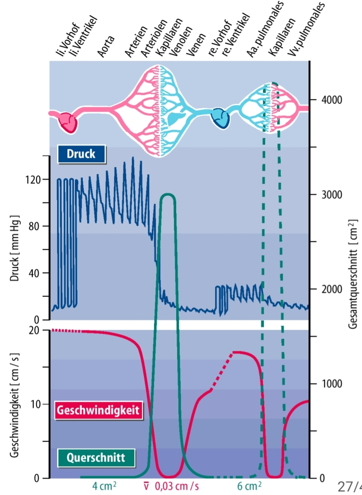

# Begriffe und Definitionen

## Organe (Wichtigste)

| Deutsch | Lateinisch | Griechisch |
| --------------- | --------------- | --------------- |
| Herz | Cor | Kardia |
| Gehirn | Cerebrum | Enkephalon |
| Lunge | Pulmo | Pneumon |
| Bauchspeicheldrüse | | Pankreas |
| Speiseröhre | Oesophagus | (Oisophagus) |
| Magen | (Ventriculus) | Gaster |

## Lagebezeichnungen

Um die Lage eines Objektes/ Organs im menschlichen Körper zu beschreiben, wird der Körper anhand von drei Ebenen unterteilt, die jeweils in der Mitte der jeweiligen Körperachse den Körper unterteilen.
Dazu zählen:

### Sagittalebene

Trennt rechte (**dexter**) von linker (**sinister**) Seite

### Frontalebene

Trennt vorne (**ventral**) von hinten (**dorsal**)

- venter: der Bauch
- dorsum: der Rücken

### Transversalebene

Trennt oben (**kranial**) von unten (**kaudal**)

- cranium: der Schädel
- cauda: der Schwanz

### Sonstiges

- proximal: zur Körpermitte hin
- distal: vom Körperzentrum entfernt

E.g. Die Schulter ist am Arm proximal, die Hand ist distal

- medial: annähernd in der Medianebene gelegen
- lateral: von der Medianebene weg, zur Seite hin

E.g Der Bauchnabel ist medial gelegen, der Ellbogen auf ähnlicher Höhe aber lateral

- superior: höher
- inferior: niedriger
- posterior: weiter hinten
- anterior: weiter vorne

## Vitalzeichen

Können durch Kontrollmonitore überwacht und aufgezeichnet werden und bestehen aus:
- Artieller Blutdruck
- Pulsfrequenz
- Atemfrequenz
- Körpertemperatur

## Diagnostisches Vorgehen

Um Krankheiten zu erkennen, schildert der Patient seine selbst wahrgenommenen **Symptome** in der **Anamnese**. Der Arzt untersucht den Patienten körperlich und notiert die festgestellten  Merkmale im **Befund** und kann aus diesem Befund eine (Verdachts-)**Diagnose** erstellen. 

Dieses Vorgehen ist nach dem Modell der Stufendiagnostik

Unterscheidung von sinvollen und nicht sinnvollen Maßnahmen für die Diagnostik:
- **Indizert**: sinvoll zu machen
- **Kontraindiziert**: nicht sinnvoll zu machen oder gar verboten, da belastend für Patienten etc.

### Anamnese

- **Eigenanamnese**: Patient wird über Symptome befragt
- **Fremdanamnese**: Angehörige, Freunde werden über Symptome des Patienten befragt
- **Vorbefunde**

### Körperliche Untersuchung

Um Krankheiten zu erkennen, schildert der Patient seine selbst wahrgenommenen **Symptome** in der **Anamnese**. Der Arzt untersucht den Patienten körperlich und notiert die festgestellten  Merkmale im **Befund** und kann aus diesem Befund eine (Verdachts-)**Diagnose** erstellen.
Diese körperliche Untersuchung kann in Form von 4 verschiedenen Maßnahmen stattfinden:

- **Inspektion**: Anschauen
- **Palpation**: Abtasten
- **Perkussion**: Abklopfen
- **Auskultation**: Horchen (mit Stethoskop)
- **Vitalzeichen** messen

### Technische Untersuchungen

- Labordiagnostik: Blut, Urin, Stuhl etc.
- Funktionstest
- Bildgebende Verfahren: Echokardiographie, CT, MRT

### Befund
- **Physiologisch**: Normalbefund
- **Pathologisch**: Auffälliger Befund
- **Kursorisch unauffällig**: Auf den ersten Blick, oberflächlich unauffällig; wurde aber nicht näher untersucht

# Herz

## Links und zusätzliche Quellen

- [kardiologie-gamm.de](https://kardiologie-gamm.de)

## Anatomie

- Lat. Name: **Cor**
- Lage: im Brustkorb (**Thorax**) überhalb des Zwerchfells (**Diaphragma**) und ist von der Lunge (**Pulmo**) umgeben
- Besteht aus rechter (**dexter**) und linker (**sinister**) Seite, jeweils mit Vorhof (**atrium**) und Herzkammer (**ventriculus**)
- Die linke Seite ist etwas kräftiger als die rechte Seite, da rechte Seite nur zur Lunge pumpen muss, die linke in den ganzen Körper
- Über die Vorhöfe kommt Blut in die Herzkammern rein, das über **Mitral** (li.) und **Trikuspidalklappe** (re.) in den Kammern gehalten wird
- Blut strömt aus Herz raus und wird von **Aorten-** (li.) und **Pulmonalklappe** (re.) in den Adern gehalten
- Herzkammern sind für den Druckaufbau da

### Herzklappen

- Stellen die Strömungsrichtung sicher

Zwischen den Kammern und abführenden Blutgefäßen:
- Aortenklappe (li.) und Pulmonalklappe (re.)
- Funktionsprinzip: **Taschenklappen**
- Sind kleiner als M. und T.

Zwischen den Vorhöfen und Kammern:
- Mitralklappe (li.) und Trikuspidalklappe (re.)
- Funktionsprinzip: **Segelklappe**
- Sind größer als A. und P.

Unterschied Taschen- und Segelklappen:
- Lediglich in der Art und Weise, wie sie sich öffnen und schließen. T. werden in eine Tasche eingezogen, während S. sich nach außen öffnen

## Weg des Blutes

- Sauerstoffarmes Blut gelangt in re. Herzkammer
- Blut wird von dort in die Lunge gepumpt und mit Sauerstoff angereichert
- Sauerstoffreiches Blut gelangt in li. Herzkammer und wird von dort in den Körper gepumpt

### Großer Kreislauf
- Körperkreislauf (Blut geht vom Herz in den Körper und wieder zum Herz)
- Hochdrucksystem (Blutdruck beträgt ca. 120/80 mmHg)
- Versorgung durch li. Herzkammer

### Kleiner Kreislauf
- Lungenkreislauf (Blut geht vom Herz zur Lunge und wieder zum Herz)
- Niederdrucksystem (Blutdruck beträgt ca. 20/8 mmHg)
- Versorgung durch re. Herzkammer

## Ablauf des Herzzyklus

### Systole

- Anspannung des Herzmuskels (1. Herzton)
- Öffnung der **Aorten-** und **Pulmonalklappe**
- Schließung der **Mitral-** und **Trikuspidalklappe**
- Blut wird in Arterien ausgetrieben

### Diastole

- Entspannung des Herzmuskels (2. Herzton)
- Schließung der **Aorten-** und **Pulmonalklappe**
- Öffnung der **Mitral-** und **Trikuspidalklappe**
- Passive Füllung der Herzkammern mit Blut aus den Venen

### Normale Erregungsausbreitung im Herzen

Dass das Herz sich zusammenziehen und entspannen kann, wird ein elektrischer Impuls am **Sinusknoten** gegeben. Diese elektrische Erregung breitet sich daraufhin im Herz aus, und die einzelnen "Unterimpulse" sind am EKG sichtbar:
- P: Ausbreitung der Erregung in den Vorhöfen => Vorhöfe ziehen sich zusammen und treiben Blut in die Herzkammern
- PQ-Strecke: Verzögerung am AV-Knoten (Atrioventrikularknoten; Nervenknoten zw. Vorhof und Kammer) für gezielte und verzögerte Weiterleitung => Zeit für Kammerfüllung 
- Q: Überleitung d. Erregung auf Kammern
- RS: Ausbreitung d. Erregung in den Kammern => Beginn Systole, da Kammerkontraktion
- T: Erregungsrückbildung der Kammern => Beginn Diastole

Nach einem EKG kann anhand der Kurve ausgewertet werden, ob die Impulse korrekt weitergeleitet werden und je nach Point of Failure ist zu erkennen, wann der Impuls nicht weiterkommt

## Diagnostik

### Auskultation

- Über "Kassendreieck" können mit Stethoskop das Herz auskultiert werden
- Bei normalem Befund (**physiologisch**) sind die beiden Herztöne wie gewohnt zu hören
- Bei auffälligem Befund (**pathologisch**) sind **Herzgeräusche** zu hören
- Je nachdem, ob die Geräusche während der Systole oder der Diastole auftreten, können Rückschlüsse auf die betroffene(n) Klappe(n) gezogen werden
- Zu beachten: Patient sollte ausatmen und die Luft anhalten, da sich Lunge mit Luft vors Herz schiebt
- Geräusche breiten sich außerdem in Blut aus, wodurch die betroffene Klappe lokalisiert werden kann

### Technische Diagnostik

- Belastungs-EKG: Riskant, da Patient bereits vulnerabel und das Herz in Ruhelage bereits belastet ist und nicht ausgereizt werden soll
- Röntgen: Erst im Spätstadium sichtbare Veränderung, da Herzmuskel nach innen wächst 

#### Elektrokardiographie (EKG)

Die Pumpfunktion des Herzen geht von einer elektrischen Erregung aus, die vom **Sinusknoten** initiiert wird und anschließend über das Herz ausgebreitet wird. Diese elektrischen **Potentialänderungen** kann man durch EKG-Elektroden an der Körperoberfläche abgreifen und relativ zur Zeitachse aufzeichnen.

Hierbei wird jedoch nur die Erregungsleitung im Herz aufgezeichnet und NICHT die tatsächliche Pumpleistung

Einsatzmöglichkeiten:
- Diagnostik von Herzrhytmusstörungen
- Diagnostik von Störungen der Erregungsausbreitung, z.B. bei:
  - Herzinfarkt (da Zellen absterben und Erregung nicht weiterleiten)
  - Elektrolytstörungen
- Diagnostik mancher Herzmuskelerkrankungen, insbesondere Hypertrophie
=> Zeichen der Linksherzhypertrophie (Herz kämpft gegen verklebte Aortenklappe an und wird somit kräftiger und wächst nach innen)
- Diagnostik der Lungenembolie (Warum? TODO)

#### Echokardiographie (Ultraschall)
- Aussendung von Ultraschallwellen (im niedrigen MHz-Bereich):
  - niedrige Frequenz: Hohe Eindringtiefe, aber niedrige Auflösung
  - hohe Frequenz: Niedrige Eindringtiefe, aber hohe Auflösung
- Sobald USW auf Gewebe treffen, wird wird ein Teil reflektiert; aus diesem Echo kann ein Bild in Graustufen erstellt werden
- Gel wird auf Haut aufgetragen um ein Luftpolster zwischen Schallkopf und Haut zu vermeiden
- wird verwendet um zu untersuchen:
  - Wanddicke
  - Klappenfunktion
  - Blutfluss (Dopplereffekt)
  - Druckgradienten
- kann **transthorakal** (minimal invasiv) oder **transösophageal** (sehr invasiv -> zweite Wahl) angewandt werden

| Vorteile   | Nachteile    |
|--------------- | --------------- |
| Minimal invasiv   | Kompromiss zwischen Auflösung und Eindringtiefe   |
| Keine Strahlenbelastung   | Komplizierte Dokumentation (Mitschrift kann fehlerhaft sein, da Arzt etwas möglicherweise nicht erkennt; 20 min Video-Material sind langwierig zu durchsuchen)   |
| Preiswert, dadurch überall verfügbar   | Nachträgliche Behandlung (z.B. durch Erfahreneren) schwierig |
| Individuell duch Untersucher steuerbar   | Probleme bei adipösen Patienten |
| Livebild, Darstellung von Bewegungen (z.B. der Herzklappen) | Störung durch Luft/Kalk, daher schlecht geeignet für die Untersuchung von Gehirn, Knochen, Lunge |
| Kombination mit Doppleruntersuchung: Darstellung von Blutströmen | |
| Guter Weichteilkontrast, daher gut geeignet zur Untersuchung von: Bauchorganen, Schilddrüse, Gefäßen, Herz (jedoch Rippen und Lunge als Hindernis) | |

### Erkrankungen an den Klappen
- **Insuffizienz**: Klappe schließt nicht richtig und Blut läuft zurück; Undichtigkeit
- **Stenose**: Klappe ist verengt und geht nicht richtig auf, wodurch Blut schlechter durchkommt; Verengung

## Aortenstenose

Aortenklappe ist verklebt und geht nicht richtig auf

### Diagnostik

Auskultation: Herzgeräusche; erster Herzton ist kein Bumm, sondern eher langgezogenes Knirschen. Langgezogen deshalb, weil das Blut länger braucht um aus dem Herzen gedrückt zu werden
Echokardiographie mit Dopplereffekt: Blut wird langsamer als im Standardfall ausgetrieben
Linksherzkatheter: sehr invasiv und wird nur verwendet wenn Herzecho nicht möglich; teuer; Letalität 1:1000

### Therapie

Ersatz der Aortenklappe:
- Bei Patienten mit Beschwerden (ggf. unter Belastung) und schwerer Stenose
- auch in hohem Lebensalter

Aufdehnung der Aortenklappe nur in Ausnahmefällen:
- Junge Patienten (angeborene Herzfehler)
- Risiko der Klappeninsuffizienz

Medikamentiöse Behandlung kaum möglich, ggf. durch:
- Behandlung eines Bluthochdrucks
- Senkung der Blutfette

| Bioprothese   | Mechanische Prothese    |
|--------------- | --------------- |
| Vom Schwein oder Kalb   | Künstliches Material   |
| Leise   | Geräuschentwicklung   |
| Kürzere Haltbarkeit  | Lange Haltbarkeit   |
| Keine lebenslange Blutverdünnung   | Lebenslange Blutverdünnung erforderlich, damit Klappe nicht durch Blutgerinnsel verklebt => Risiko von Nebenwirkungen!  |
| Wird eher bei älteren Personen eingesetzt | Wird häufig bei jungen Personen eingesetzt |

### Operationstechnik

#### OP am offenen Herzen

- Einsatz der Herz-Lungen-Maschine
- OP-Sterblichkeit bei noch ausreichender Pumpfunktion 2-4%

#### Minimalinvasive OP (nur Bioprothese)

- Zugang über die Leiste (wie Herzkatheter) oder Herzspitze
- Alternative bei schwerkranken Patienten
- Sterblichkeitsrate nach 1 Jahr gleich niedrig wie konventionelle OP

### Prognose der Krankheit

- Gute Prognose bei Beschwerdefreiheit (plötzlicher Herztod < 1% pro Jahr)
- Durchschnittliche Lebenserwartung:
  - bei Atemnot/Brustschmerzen: 4-5 Jahre
  - bei Ohnmachtsanfällen: 2-3 Jahre
  - bei Zeichen der Pumpschwäche: 1-2 Jahre
- Überlebensrate liegt nach OP bei 80-90% über 5 Jahre

## Koronare Herzkrankheit

Chronische Erkrankung des Herzens, die zu Verengung der **Koronararterien** (Arterien, die das Herz umgeben und mit Blut versorgen) führt und zu Minderdurchblutung führt.
=> AV-Block kann daraus folgen

## AV-Block

[DocCheck Flexikon - AV-Block](https://flexikon.doccheck.com/de/AV-Block)

Herzrhytmusstörung, die durch Leitungsstörungen zwischen den Atrien und Ventrikeln entstehen

Diagnostik:
- Übelkeit, Schwindel, Dyspnoe
- Niedrigerer Puls
- mögliche Vorerkrankung des Herzen oder KHK

### Was ist das Problem?

Bei EKG-Befund zeigt die P-Welle an, dass die Vorhöfe erregt werden und sich optimalerweise zusammenziehen sollten. Nach kurzer Verzögerung sollte die Erregung am AV-Knoten an die Kammern gegeben werden, was aber nicht immer zuverlässig passiert

Je nach Ausprägung (Verzögerung oder komplette Blockierung des Erregers) kann dies zu einer **Reduktion der Herzfrequenz** führen, sodass die Pumpleistung des Herzen abfällt 

### Therapie

Bei "harmloseren" Ausprägungen meist keine Therapie nötig, ggf. Absetzen/Dosisreduktion der Medikamente

#### ... der Ursache

Therapie der zugrundeliegenden KHK 

Absetzen/Dosisreduktion von Medikamenten, da Arrhythmien auslösen können

#### ... der Symptome - Herzschrittmacher

Elektrische Aktivität in Vorhof und Kammer wird gemessen und ausbleibende Impulse werden erkannt (z.B. Fehlen d. QRS-Komplexes), woraufhin eine Impuls erzeugt wird

Muss nicht zwangsweise von Hezrchirurg eingesetzt werden; OP kann auch in Kardiologie erfolgen

Aggregat wird subkutan oder unterhalb der Brustmuskulatur eingesetzt. Sonden werden durch Vene vorgeschoben und im rechten Vorhof/Kammer verankert (Vene wird benutzt, da weniger Druck als in Arterie)

Letalitätsrisiko praktisch 0

# Arterielle Hypertonie

## Blutdruck

Abkürzung RR, nach Riva-Rocci

|  | Systolisch | Diastolisch |
| --------------- | --------------- | --------------- |
| Definition | RR, der während der Systole (Auswurfphase) im Gefäßsystem herrscht | RR, der während der Diastole (Entspannungsphase) im Gefäßsystem herrscht |
| Optimalwert | < 120 mmHg | < 80 mmHg |
| Normal - Hochnormal | 120-139 mmHg | 80-89 mmHg |
| Hypertonie | > 140 mmHg | > 90 mmHg |

Der Blutdruck ergibt sich aus dem **Herzzeitvolumen * Widerstand**, d.h. eine Änderung des Volumens des Blutes, des Widerstands, oder der Durchfußgeschwindigkeit wirkt sich direkt auf den Blutdruck aus

## Beschwerden

- Oft symptomlos
- ggf. Kopfschmerzen, v.a. morgens => Besserung bei Hochlagerung des Kopfes
- Schwindel, Ohrensausen
- Herzklopfen, Herzschmerzen
- Nasenbluten
- Belastungsdyspnoe

## Blutgefäße

 Bestehen im Wesentlichen aus drei Schichten, den **tunicae interna/media/externa**

### Arterien

#### Aufbau

Von innen nach außen:
Tunica interna
- Endothel
- Basalmembran
- Lamina elastica interna (Membran aus elastischen Fasern; ermöglicht Konstriktion und Dilatation)
Tunica media:
- glatter Muskel (dicker als in Vene, Durchflußbegrenzung nur hier nötig)
- Lamina elastica externa (ut supra)

#### Typen 

- Aorta und große Schlagadern
  - Elastischer Type
  - Windkesselfunktion (dehnt sich bei Systole langsam mit aus und zieht sich in der Diastole passiv wieder zusammen)
  - => Transport Blut in Organe
- Mittlere und kleine Schlagadern
  - Muskulärer Typ
  - => Steuerung des Widerstands
- Arteriolen
  - zunehmend dünnere Gefäße
- Kapillaren
  - nur noch Innenschicht
  - => Gas- und Stoffaustausch

### Venen

#### Aufbau

Ähnlich wie Arterie, jedoch ohne Laminae elasticae und der glatte Muskel ist viel dünner

Durchmesser wesentlich höher; außerdem Klappen als Rückschlagventile, sodass Blut nicht zurückfließt, wenn es ohne Druck gegen die Schwerkraft Richtung Herz fließt.

## Blutdruckkurven und Strömungsgeschwindigkeiten

Hier ist schematisch der Weg eines einzelnen Blutkörperchens auf dem Weg durch den Körper beginnend mit dem li. Vorhof und wann welche Messgrößen herrschen:

- Große Arterien:
  - geringer Durchschnitt
  - hoher Druck (Körperkreislauf)
  - schneller Fluß
  - Blut muss, no matter what, in die Organe!
- Kapillaren
  - hoher Durchschnitt
  - niedriger Druck
  - langsamer Fluß
  - Zeit für Stoffaustausch!
- Venen
  - hoher Durchschnitt
  - niedriger Druck (keine Pumpe!)
  - relativ langsamer Fluß

## Blutverteilung

Verschiedene Organe benötigen im Standardfall unterschiedlich viel Blut um zu funktionieren

Je nach Bedarf wird das Blut umverteilt und manche Organe werden stärker oder weniger stark durchblutet, z.B. durch:

| Aktivität | Organe mit stärkerer Durchblutung | Organe mit geringerer Durchblutung |
| --------------- | --------------- | --------------- |
| Arbeit, Sport | Muskeln, Herz | Ausscheidung, Verdauung |
| Entspannung, Schlaf | Verdauung, Ausscheidung | Muskeln |

Größte Variabilität: Skelettmuskel
Kaum Variabilität, zumindest nicht nach unten: Gehirn und Herz (kann nicht unter Standardaktiviät funktionieren)

Stärkere Durchblutung wird erreicht durch **Gefäßerweiterung** (Dilatation)

Geringere Durchblutung wird erreicht durch **Gefäßverengung** (Konstriktion)

## Vegetatives Nervensystem

Selbstregelndes Nervensystem, das die Selbsterhaltung des Körpers aufrechterhält und Funktion der Organe gewährleistet

Evolutionärer Hintergrund:
- Flucht-/Kampfreaktion => **Sympathikus**
- Nahrungsverwertung, Entspannung => **Parasympathikus**
- Beide existieren als Gegenspieler, haben meist gegenläufige Effekte am selben Organ
- Blut wird daraufhin umverteilt (ut supra)

### Sympathikus

- Ursprung größtenteils im Rückenmark der Brustwirbelsäule
- Signalübertragung durch **Adrenalin** (Stresshormon)
- wird aktiviert, wenn Körper in einer Hochbelastungssituation gelangt

### Parasympathikus

- Ursprung größtenteils im Hirnstamm
- Signalübertragung durch **Acetylcholin**

### α-Rezeptoren

- Stimulation glatter Muskelzellen
=> **Gefäßkonstriktion** (Verengung)
- Vorkommen v.a. Darm-, Hautgefäße

### β-Rezeptoren

- Entspannung glatter Muskelzellen
=> **Gefäßdilatation** (Erweiterung)
- Vorkommen v.a. Muskelgefäße, Herzkranzgefäße, kleine Bronchien
- Steigerung der Herzfrequenz, Schlagkraft, Atemleistung
- Steigerung des Abbaus von Energiespeichern (Leber, Muskel, Fettgewebe)

### Medikamentöse Nutzung der Adrenorezeptoren

- Nasenspray: α-Mimetika (Tut so, als wäre es Adrenalin, das an α-Rezeptoren andocken kann)
=> Verengung der Nasenchleimhautgefäße
- Asthmatherapie: β-Mimetika
=> Entspannung der Bronchiolen
- Bluthochdruck: β-Blocker
=> Senkung der Herzfrequenz und Schlagkraft
=> Nebenwirkungen: Asthmaanfälle, Erektionsstörungen
- Bluthochdruck: α-Blocker (v.a. in Blutdruckkrisen)

## Blutdruckmessung nach Riva-Rocci

Das Blut drückt mit einem gewissen Druck vom Herzen in die Arterien und Richtung da wo es gebraucht wird. Der RR wird gemessen, indem mit einem höheren Druck die Arterien "abgeschnürt" werden. Danach wird langsam der Druck abgelassen und der Druck, bei dem das Einstromgeräusch als erstes zu vernehmen ist, ist der systolische Blutdruckwert. Das Geräusch, bei dem das Einströmgeräusch verwindet, ist der diastolische Blutdruckwert

In Kurzform:
- Kompression der Arterien
- langsame Drucksenkung
- Erkennen des Einstromgeräusches:
  - Erstes Auftreten: Systolischer Blutdruckwert
  - Verschwinden/markant leiser und dumpfer: Diastolischer Blutdruckwert

Zu Beachten:
- Messpunkt auf Herzhöhe (üblich am Arm über Ellbogen)
- Messung in Ruhe, ggf. Liegen/Sitzen/Stehen 
- Mindestens einmal beidseitig messen 
- Nicht an einem Arm messen, an dem:
  - ein Gefäßzugang liegt
  - ein Dialyse-Shunt vorhanden ist
  - auf dessen Seite z.B. eine Brustkrebs-OP war
- Korrekte Manschettenbreite ca. 1/2 Armumfang
  - zu breit: falsch niedrige Werte
  - zu schmal: falsch hohe Werte 
- Ohne Stethoskop:
  - Palpatorische Messung, wann der Radialpuls wieder erfühlbar ist
  - Nur systolischer Druck messbar

## Kurz- mittelfristige Blutdruckregulation

Der Körper kann den globalen Blutdruck sehr schnell durch Ausschüttung einiger Substanzen steuern:

Vasokonstriktion:
- Vasopressin (ADH)
- Angiotensin II
- Sympathikus, Adrenalin (Haut, Darm, Niere)

Vasodilatation:
- Entzündungsmediatoren
- Sympathikus, Adrenalin (Gehirn, Herz, Muskeln)

### Kurzfristige Blutdruckregulation: Vegetatives Nervensystem

